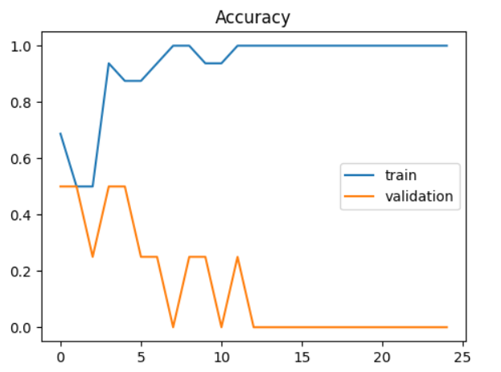
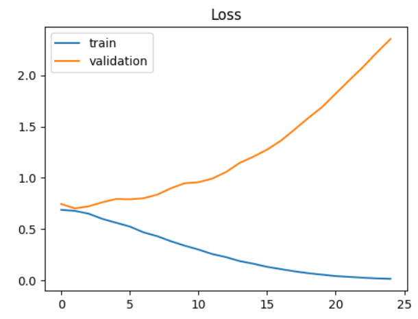

# 🐱🐶 Cat vs Dog Image Classifier (Deep Learning)

<p align="center">


</p>

---

# 📌 Project Overview

This project is a **Deep Learning Image Classification Model** that identifies whether an image contains a **Cat 🐱 or Dog 🐶**.

The model is trained using **Convolutional Neural Networks (CNN)** built with **TensorFlow** and image preprocessing using **OpenCV**.

The goal of this project is to demonstrate a **complete deep learning workflow**, including:

* Dataset preparation
* Image preprocessing
* CNN model building
* Training and validation
* Model evaluation
* Prediction on new images

---

# 🧠 Technologies Used

| Technology   | Purpose                         |
| ------------ | ------------------------------- |
| Python       | Programming language            |
| TensorFlow   | Deep Learning framework         |
| OpenCV       | Image processing                |
| NumPy        | Numerical operations            |
| Matplotlib   | Training visualization          |
| Scikit-learn | Train/Test split and evaluation |

---

# 🏗 Project Structure

```
project8
│
├── Cat-Dog-classifier.ipynb
├── README.md
│
├── dataset
│   ├── cats
│   │   ├── 1.jpg
│   │   └── ... up to 10 images
│   │
│   └── dogs
│       ├── 1.jpg
│       └── ... up to 10 images
│
├── test_images
│   ├── test1.jpg
│   └── test2.jpg
│
├── cat_dog_model.keras
│
└── images
    ├── accuracy_graph.png
    ├── loss_graph.png
    ├── prediction1.png
    └── prediction2.png
```

---

# 📊 Model Architecture

The classifier is built using a **Convolutional Neural Network (CNN)** consisting of:

* Convolution Layers
* MaxPooling Layers
* Flatten Layer
* Fully Connected Dense Layers
* Sigmoid Output Layer

The model predicts:

```
0 → Cat
1 → Dog
```

---

# 📈 Training Results

## Accuracy Graph

<p align="center">

</p>

This graph shows the **training and validation accuracy across epochs**.

---

## Loss Graph

<p align="center">

</p>

The loss graph demonstrates how the model **optimizes during training**.

---

# 🔎 Prediction Results

### Cat Prediction (Correct)

<p align="center">

</p>

---

### Dog Prediction (Incorrect)

<p align="center">

</p>

Because the dataset is very small, the model may sometimes misclassify images.

---

# ⚠️ Dataset Limitation

The dataset used in this project contains only:

```
10 Cat images
10 Dog images
```

Deep learning models usually require **hundreds or thousands of images** for high accuracy.

Therefore, this project is intended as a **learning demonstration of deep learning workflow** rather than a production-level model.

---

# 🚀 How to Run the Project

### 1️⃣ Clone the repository

```
git clone https://github.com/yourusername/project8.git
```

---

### 2️⃣ Install dependencies

```
pip install tensorflow opencv-python numpy matplotlib scikit-learn
```

---

### 3️⃣ Run the notebook

Open the notebook:

```
Cat-Dog-classifier.ipynb
```

Run all cells to:

* Train the model
* Evaluate performance
* Predict new images

---

# 📌 Example Prediction Output

```
Prediction: Dog 🐶
Confidence: 82.45%
```

The model also displays the **input image along with the prediction result**.

---

# 🔮 Future Improvements

Possible improvements for this project:

* Increase dataset size
* Apply Data Augmentation
* Use Transfer Learning
* Improve model architecture
* Deploy as a Web Application

---

# 👨‍💻 Author

**Harman**

Deep Learning & AI Enthusiast

---

# ⭐ Support

If you found this project helpful, consider **starring the repository on GitHub** ⭐
